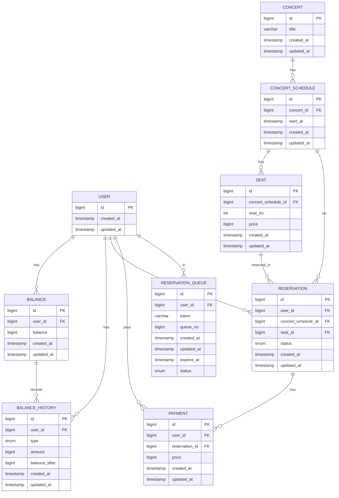

```mermaid
erDiagram
USER ||--o{ BALANCE : has
USER ||--o{ BALANCE_HISTORY : has
USER ||--o{ RESERVATION : makes
USER ||--o{ PAYMENT : pays
USER ||--o{ RESERVATION_QUEUE : in

    CONCERT ||--o{ CONCERT_SCHEDULE : has
    CONCERT_SCHEDULE ||--o{ SEAT : has
    CONCERT_SCHEDULE ||--o{ RESERVATION : for
    SEAT ||--o{ RESERVATION : reserved_in
    RESERVATION ||--o{ PAYMENT : has

    BALANCE ||--o{ BALANCE_HISTORY : records

    USER {
        bigint id PK
        timestamp created_at
        timestamp updated_at
    }
    BALANCE {
        bigint id PK
        bigint user_id FK
        bigint balance
        timestamp created_at
        timestamp updated_at
    }
    BALANCE_HISTORY {
        bigint id PK
        bigint user_id FK
        enum type
        bigint amount
        bigint balance_after
        timestamp created_at
        timestamp updated_at
    }
    RESERVATION_QUEUE {
        bigint id PK
        bigint user_id FK
        varchar token
        bigint queue_no
        timestamp created_at
        timestamp updated_at
        timestamp expires_at
        enum status
    }
    CONCERT {
        bigint id PK
        varchar title
        timestamp created_at
        timestamp updated_at
    }
    CONCERT_SCHEDULE {
        bigint id PK
        bigint concert_id FK
        timestamp start_at
        timestamp created_at
        timestamp updated_at
    }
    SEAT {
        bigint id PK
        bigint concert_schedule_id FK
        int seat_no
        bigint price
        timestamp created_at
        timestamp updated_at
    }
    RESERVATION {
        bigint id PK
        bigint user_id FK
        bigint concert_schedule_id FK
        bigint seat_id FK
        enum status
        timestamp created_at
        timestamp updated_at
    }
    PAYMENT {
        bigint id PK
        bigint user_id FK
        bigint reservation_id FK
        bigint price
        timestamp created_at
        timestamp updated_at
    }
```
