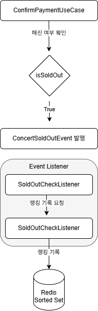

# 콘서트 예매 시스템 - 실시간 매진 랭킹 시스템 설계 보고서

## 1. 개요

본 문서는 콘서트 예매 시스템의 **빠른 매진 랭킹** 기능의 설계 및 구현에 대해서 서술.
**Redis의 Sorted Set**을 핵심 기술로 사용하여 실시간 랭킹 시스템을 구현.
대규모 트래픽 환경에서의 동시성, 데이터 정합성, 그리고 시스템 간의 느슨한 결합(Loose Coupling)을 주요 목표.

---

## 2. 문제 상황 및 목표

### 2.1. 문제 상황
- 기존 시스템에서는 어떤 콘서트가 얼마나 빨리 매진되었는지에 대한 데이터를 수집하거나 사용자에게 보여주는 기능이 없음.
- 사용자는 인기 있는 콘서트를 직관적으로 파악하기 어려운 문제 발생.
- 결제와 같이 민감한 핵심 로직에 영향을 주지 않으면서, 안정적으로 랭킹 데이터 집계 필요.

### 2.2. 목표
1.  **정확한 매진 시점 감지**: 특정 콘서트 회차의 마지막 좌석이 판매되는 시점을 감지.
2.  **실시간 랭킹 업데이트**: 매진된 콘서트 정보를 '매진까지 걸린 시간' 순서대로 실시간으로 랭킹에 반영.
3.  **안정적인 시스템 구축**: 결제 시스템과 랭킹 시스템을 분리하여, 랭킹 시스템의 장애가 핵심 서비스에 영향을 미치지 않도록 설계.
4.  **높은 신뢰도의 테스트**: 단위 테스트와 통합 테스트를 통해 기능의 안정성과 데이터의 정합성을 보장.

---

## 3. 핵심 전략 및 아키텍처

### 3.1. 핵심 기술: Redis Sorted Set
- **Redis**: 빠른 연산속도와 **랭킹 구현에 최적화된 자료구조를 제공**하기 때문에 선택.

- **자료구조**: 멤버(Member)와 점수(Score)로 구성된 Redis의 `Sorted Set`을 사용하여 랭킹 시스템을 구현.
    - **Key**: `concert:schedule:ranking` (랭킹 보드의 고유 이름)
    - **Member**: `concert:{concertId}:schedule:{scheduleId}` (매진된 콘서트 회차의 고유 식별자)
    - **Score**: `매진까지 걸린 시간 (초 단위)` (점수가 낮을수록 순위가 높음)
- **선택 이유**:
    - **빠른 성능**: 모든 연산이 메모리 내에서 처리되어 실시간 랭킹 업데이트 적합.
    - **랭킹 최적화**: 데이터 추가(`ZADD`), 순위별 조회(`ZRANGE`) 등 랭킹 관련 연산을 O(log N)의 시간 복잡도로 효율적으로 처리.

### 3.2. 아키텍처: 이벤트 기반 비동기 처리
결제 로직과 랭킹 기록 로직을 분리하기 위해 **스프링의 이벤트 기반 아키텍처**로 구현합니다.

**처리 흐름:**
1.  **결제 확정 및 매진 확인**: `ConfirmPaymentUseCase`에서 사용자의 결제를 최종 처리하고, 해당 회차가 매진되었는지 확인.
2.  **이벤트 발행**: 매진이 확인되면, `ApplicationEventPublisher`를 통해 `ConcertSoldOutEvent`를 발행.
3.  **이벤트 수신**: `SoldOutCheckListener`가 `@TransactionalEventListener`를 통해 이벤트를 안전하게 수신.
4.  **랭킹 기록**: `Listener`는 `RecordSoldOutUseCase`를 호출하여 Redis에 랭킹 정보를 최종 기록.

**기대 효과**:
- **결합도 감소**: 결제 로직은 랭킹 시스템의 존재를 알 필요가 없어, 각 시스템의 독립적인 개발 및 유지보수가 가능.
- **확장성 증가**: 향후 '매진 시 SMS 알림' 등 추가 기능이 필요할 경우, 새로운 리스너를 추가하는 것만으로 쉽게 확장 가능.
- **안정성 확보**: 랭킹 기록 중 오류가 발생해도 결제 트랜잭션에는 영향 없음.

---

## 4. 상세 설계

### 4.1. 매진 판별 로직
- **위치**: `ConfirmPaymentUseCase` 내 `isSoldOut`
- **실행 시점**: 결제 관련 모든 데이터베이스 작업(`save`)이 완료된 후
- **판별 기준**: 아래 두 조건이 일치할 때 '매진'으로 간주.
  > `[해당 회차의 총 좌석 수] == [상태가 'CONFIRMED'인 예약 수]`
- **근거**: `Reservation`의 `CONFIRMED` 상태는 결제가 최종 완료되었음을 나타내는 데이터.

### 4.2. 이벤트 처리 설계
- **`ConcertSoldOutEvent`**: `concertId`와 `concertScheduleId`를 데이터로 포함하는 POJO 클래스.
- **`@TransactionalEventListener`**: `ConfirmPaymentUseCase`의 트랜잭션이 **성공적으로 커밋(Commit)된 후에만** 리스너가 동작하도록 하여 데이터 정합성을 보장.

### 4.3. 랭킹 기록 로직
- **위치**: `RecordSoldOutUseCase`
- **로직**:
    1.  `concertScheduleId`로 `ConcertSchedule` 정보를 조회하여 '티켓 판매 시작 시간'을 조회.
    2.  `Duration.between(판매 시작 시간, 현재 시간)`을 통해 '매진까지 걸린 시간(초)'을 계산.
    3.  `redisTemplate.opsForZSet().add()`를 사용하여 Redis Sorted Set에 랭킹을 기록.

---