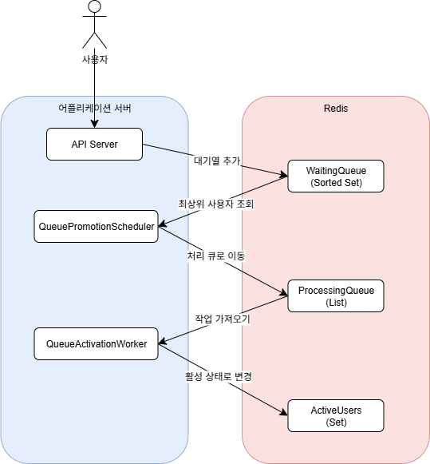

## 1. 개요

### 1.1. 문제 정의

콘서트 티켓 예매 시작 시점에는 예측 불가능한 대규모 트래픽이 특정 시간에 집중됨. 
이때 발생하는 동시성 문제를 해결하고, 사용자에게 공정한 대기 순서를 보장할 수 있도록 개선.

### 1.2. 목표

- **확장성 :** 부하에 따라 시스템의 각 구성 요소를 독립적으로 확장할 수 있는 구조로 설계.
- **공정성 :** 사용자에게 선착순(FIFO) 대기를 보장.

---

## 2. 핵심 아키텍처: 비동기 MQ 모델

생산자-소비자(Producer-Consumer) 패턴을 기반으로 하는 비동기 메시지 큐(MQ) 모델로 구현. 
Redis의 다양한 데이터 구조를 활용하여 각 요구사항을 해결.

### 2.1. 구성 요소

| 컴포넌트 | Redis 데이터 구조 | 역할                                                                      |
| --- | --- |-------------------------------------------------------------------------|
| **대기열 (Waiting Queue)** | `Sorted Set` | 사용자의 대기 순서를 timestamp를 score로 하여 관리. 순위 조회(ZRANK), 전체 크기(ZCARD) 조회에 용이. |
| **처리 큐 (Processing Queue)** | `List` | 스케줄러가 선정한 사용자를 워커에게 전달하는 버퍼/메시지 큐 역할.                                   |
| **활성 사용자 풀 (Active Pool)** | `Set` | 현재 예약 페이지에 진입하여 활동 중인 사용자들을 관리.                                         |
| **프로듀서 (Producer)** | `QueuePromotionScheduler` | 주기적으로 활성 사용자 풀의 빈자리를 확인하고, 대기열의 최상위 사용자를 처리 큐로 이동.                      |
| **컨슈머 (Consumer)** | `QueueActivationWorker` | 처리 큐를 감시하다가 작업이 들어오면 실제 사용자 활성화를 담당하는 이벤트 기반 작업자.                       |

### 2.2. 처리 흐름

---

## 3. 개선 전/후 시스템 비교

| 비교 항목 | 개선 전 (단순 폴링 모델) | 개선 후 (비동기 MQ 모델) |
| --- | --- | --- |
| **구조** | 스케줄러가 대기열 조회부터 활성화까지 모든 책임을 가짐. Waiting -> Active로 직접 전환. | 역할 분리: 스케줄러와 워커가 명확히 분리됨. Waiting -> Processing -> Active의 단계를 거침. |
| **안정성** | 스케줄러 실패 시, 일부 사용자는 활성화되고 일부는 누락되는 등 상태 불일치 발생 가능성이 높음. | 처리 큐가 완충제 역할을 하여, 워커에 장애가 발생해도 작업이 유실되지 않고 재처리가 가능. |
| **확장성** | 시스템 전체를 확장해야 하므로 비용 비효율적. | 독립적 확장 가능. 처리 속도가 문제라면 워커(컨슈머)만, 요청 접수가 문제라면 API 서버만 증설하면 됨. |
| **자원 효율성** | 워커의 개념이 없어, 복잡한 로직을 스케줄러 스레드가 모두 처리해야 함. | 워커는 작업이 있을 때만 동작하고(Blocking), 없을 때는 대기하여 CPU 자원을 효율적으로 사용. |

---

## 4. 결론

단순 폴링 방식에서 생산자-소비자 패턴 기반의 비동기 MQ 모델로 전환함으로써, 
대규모 트래픽을 안정적으로 처리할 수 있는 확장성 및 장애 허용 시스템을 구축. 
Redis의 `Sorted Set`을 활용하여 대기열의 핵심 요구사항인 순서 보장과 순위 조회 문제를 해결.
