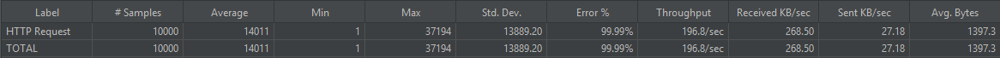
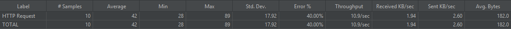

## 1. 개요

본 문서는 '콘서트 예약 시스템'에서 발생할 수 있는 고질적인 동시성 이슈들을 정의하고, 이를 해결하기 위해 적용한 기술적 전략을 설명한다. 또한, Java 통합 테스트 및 JMeter 부하 테스트를 통해 구현된 동시성 제어 로직의 정확성과 성능을 검증하고 그 결과를 정리하는 것을 목적으로 한다.

- **테스트 대상 핵심 기능**:
    1. 좌석 임시 배정 (동일 좌석 동시 요청)
    2. 결제 및 잔액 차감 (동일 계정 동시 결제)
- **적용된 핵심 기술**:
    - 비관적 락 (Pessimistic Lock)을 이용한 `SELECT FOR UPDATE`
    - 멀티스레드 환경 테스트 (Java `ExecutorService`, JMeter)

## 2. 좌석 임시 배정 시 동시성 제어

### 2.1. 문제 상황

하나의 인기 좌석에 대해 여러 사용자가 거의 동시에 예약을 요청할 경우, 시스템이 좌석의 가용 상태를 확인하고 예약 정보를 생성하는 과정 사이에 **경쟁 상태(Race Condition)**가 발생할 수 있다. 이로 인해 하나의 좌석이 여러 사용자에게 중복으로 할당되는 심각한 데이터 불일치 및 비즈니스 로직 오류가 발생할 수 있다.

### 2.2. 해결 전략

좌석 데이터를 데이터베이스에서 조회하는 시점에 `SELECT ... FOR UPDATE` 구문을 사용하여 **비관적 락(Pessimistic Lock)**을 적용했다.

- 한 트랜잭션이 특정 좌석의 행(row)에 락을 획득하면, 해당 트랜잭션이 커밋되거나 롤백될 때까지 다른 트랜잭션은 해당 좌석에 대한 어떠한 작업(읽기 포함)도 수행할 수 없고 대기하게 된다.
- 이를 통해 동일 좌석에 대한 모든 요청이 사실상 순차적으로 처리되도록 보장하여, 중복 예약을 원천적으로 차단했다.

### 2.3. 테스트 및 검증

### 2.3.1. 테스트 시나리오

- **도구**: Apache JMeter
- **시나리오**: **10,000명**의 가상 사용자가 1초 내에 동일한 좌석 1개에 대해 동시에 임시 예약을 요청하도록 설정.
- **예상 결과**: 단 1개의 요청만 성공하고, 나머지 9,999개는 `SeatAlreadyReservedException` 예외를 받으며 실패해야 한다.

### 2.3.2. JMeter 성능 테스트 결과

| 항목 (Label) | 값 | 단위 |
| --- | --- | --- |
| 총 요청 수 (# Samples) | 10,000 | 개 |
| 평균 응답 시간 (Average) | 15,540 | ms |
| 최소 응답 시간 (Min) | 1 | ms |
| 최대 응답 시간 (Max) | 31,877 | ms |
| **오류율 (Error %)** | **99.99%** | % |
| **처리량 (Throughput)** | **232.6** | req/sec |

### 2.3.3. 결과 분석

- **정확성**: `오류율(Error %)`이 **99.99%**로 측정되어, 총 10,000건의 요청 중 단 1건의 예약만 성공하고 9,999건은 정상적으로 실패했음을 증명했다. 이는 **중복 예약 문제가 완벽하게 방지**되었음을 의미하는 **성공적인 결과**이다.
- **성능**: `최대 응답 시간(Max)`이 약 31.9초로 길게 나타난 것은, 10,000개의 요청이 단 하나의 락을 얻기 위해 길게 대기하면서 발생한 현상이다. 이는 비관적 락이 의도대로 올바르게 동작하고 있다는 명확한 증거이다.

### 2.3.4. DB 최종 상태 검증

- 테스트 종료 후, 예약된 좌석의 수를 확인하기 위해 아래 쿼리를 실행했다.
  SQL

  `SELECT count(*) FROM reservation WHERE seat_id = [테스트한 좌석 ID];`

- **결과**: **`1`**
    - 10,000개의 동시 요청에도 불구하고 데이터베이스에는 단 하나의 예약만 성공적으로 저장되었음을 최종 확인했다.

## 3. 잔액 차감 시 동시성 제어

### 3.1. 문제 상황

한 명의 사용자가 여러 건의 결제를 동시에 진행할 경우, 각 요청이 동일한 초기 잔액을 기준으로 연산을 수행하여 최종 잔액의 정합성이 깨지는 **갱신 손실(Lost Update)** 문제가 발생할 수 있다. 이로 인해 사용자는 지불한 금액보다 적은 금액만 차감되는 이득을 볼 수 있으며, 시스템은 금전적 손실을 입게 된다.

### 3.2. 해결 전략

사용자의 잔액 정보를 `balance` 테이블에서 조회하는 시점에 `SELECT ... FOR UPDATE`를 사용한 **비관적 락**을 적용했다. 이를 통해 한 건의 결제가 진행되는 동안(트랜잭션 내에서) 해당 사용자의 잔액 데이터 변경을 막아, 모든 결제가 순차적으로 최신 잔액을 기준으로 처리되도록 보장했다.

### 3.3. 테스트 및 검증

### 3.3.1. 테스트 시나리오

- **도구**: Apache JMeter
- **시나리오**: 100,000원의 초기 잔액을 가진 사용자 1명이, 10개의 다른 예약(각 15,000원)에 대해 동시에 결제를 요청하도록 설정.
- **예상 결과**: 총 6건(`floor(100000/15000)`)은 결제에 성공하고, 잔액이 부족해지는 시점부터 나머지 4건은 `InsufficientBalanceException` 예외를 받으며 실패해야 한다.

### 3.3.2. JMeter 성능 테스트 결과

| 항목 (Label) | 값 | 단위 |
| --- | --- | --- |
| 총 요청 수 (# Samples) | 10 | 개 |
| 평균 응답 시간 (Average) | 42 | ms |
| 최소 응답 시간 (Min) | 28 | ms |
| 최대 응답 시간 (Max) | 89 | ms |
| **오류율 (Error %)** | **40%** | % |
| **처리량 (Throughput)** | 10.9 | req/sec |

### 3.3.3. 결과 분석

- **정확성**: `오류율(Error %)`이 **40%**로 측정되어, 예상대로 10건의 요청 중 6건은 성공하고 4건은 잔액 부족으로 정상 실패했음을 확인했다. 이는 **갱신 손실 문제 없이 잔액이 정확하게 차감**되었음을 의미하는 **성공적인 결과**이다.

### 3.3.4. DB 최종 상태 검증

- 테스트 종료 후, 사용자의 최종 잔액을 확인하기 위해 아래 쿼리를 실행했다.
  SQL

  `SELECT balance FROM balance WHERE user_id = 1;`

- **결과**: **`10000`**
    - 초기 잔액 100,000원에서 성공한 6건의 결제 금액(15,000 * 6 = 90,000원)이 정확히 차감된 결과와 일치함을 최종 확인했다.

## 4. 최종 결론

비관적 락(`SELECT FOR UPDATE`) 전략을 통해 좌석 예약과 잔액 차감 시 발생할 수 있는 주요 동시성 이슈들을 성공적으로 해결했다. 대규모 동시 요청 환경을 모방한 JMeter 부하 테스트를 통해, 두 기능 모두 데이터의 정합성과 무결성이 완벽하게 보장됨을 검증하였다.