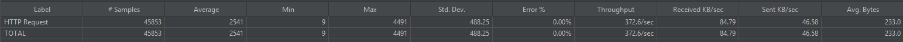
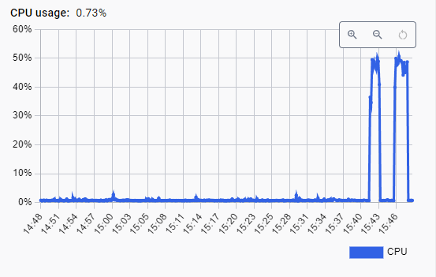
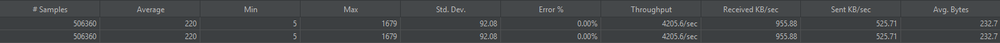
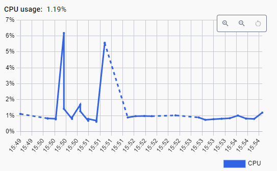

### **1. 요구사항 분석**

본 과제의 목표는 대규모 트래픽이 발생하는 콘서트 예매 시스템의 비즈니스 시나리오를 분석하고, 조회 성능 저하가 예상되는 구간을 식별하여 Redis를 활용한 캐싱 전략을 설계 및 구현하는 것입니다. 이를 통해 애플리케이션의 전반적인 요청 처리 성능을 향상시키는 데 중점을 둡니다.

---

### **2. 캐싱 전략 분석 및 설계**

### **2.1. 예약 가능 날짜 조회 API**

- **API:** `GET /api/availability/{concertId}/dates`
- **API 설명:** 특정 콘서트의 예약 가능한 모든 날짜를 조회합니다.
- **분석:**
    - **조회 빈도:** 예약 과정에서 매우 자주 조회될 것으로 예상됩니다.
    - **변경 빈도:** 콘서트 일정은 한번 확정되면 거의 변경되지 않으므로 데이터 변경 빈도는 낮습니다.
    - **쿼리 성능:** `concertId` 기준의 단순 조회이므로 인덱스가 있다면 빠르지만, 트래픽 집중 시 부하가 발생할 수 있습니다.
- **캐싱 필요 유스케이스:**
    - 사용자가 콘서트 예약 페이지에 진입할 때마다 호출됩니다.
- **분석 종합:**
    - **캐싱 적절도:** ★★★★★
    - **근거:** 데이터 변경이 적고 읽기 요청이 매우 빈번하여 캐싱을 통한 성능 개선 효과가 매우 클 것으로 기대됩니다.
- **최종 전략:**
    - **캐싱 전략:** Look-aside 캐싱을 선택합니다. 데이터 읽기 빈도가 쓰기 빈도보다 압도적으로 높기 때문입니다.
    - **캐시 유형:** 글로벌 캐시(Redis)를 선택합니다. 특정 콘서트의 날짜 정보는 모든 사용자에게 동일하게 제공되어야 하며, 중앙에서 관리하는 것이 데이터 일관성 유지에 용이하기 때문입니다.

### **2.2. 예약 가능 좌석 조회 API**

- **API:** `GET /api/availability/schedules/{scheduleId}/seats`
- **API 설명:** 특정 콘서트 회차의 예약 가능한 좌석 목록을 조회합니다.
- **분석:**
    - **조회 빈도:** 좌석 선택 단계에서 사용자에 의해 매우 자주 조회됩니다.
    - **변경 빈도:** 실시간 좌석 예약 및 취소로 인해 데이터 변경 빈도는 중간 수준입니다.
    - **쿼리 성능:** 동시 조회 요청이 많을 경우 성능 저하 가능성이 존재합니다.
- **캐싱 필요 유스케이스:**
    - 여러 사용자가 동시에 동일한 콘서트 회차의 좌석을 조회할 때 DB 부하를 줄일 수 있습니다.
    - 특정 사용자가 좌석을 고민하며 짧은 시간 내에 반복적으로 조회하는 패턴에 효과적으로 대응할 수 있습니다.
- **분석 종합:**
    - **캐싱 적절도:** ★★★★☆
    - **근거:** 높은 조회 빈도와 중간 수준의 데이터 변경률을 고려할 때, 캐싱을 통해 얻는 성능 이점이 큽니다.
- **최종 전략:**
    - **캐싱 전략:** **Look-aside 캐싱과 명시적 캐시 무효화(Cache Eviction) 전략을 함께 사용**합니다.
        - **조회 시(`@Cacheable`):** `getAvailableSeats` 메소드를 통해 조회된 '예약 가능 좌석 목록'을 캐시에 저장하여 반복 조회의 성능을 높입니다.
        - **상태 변경 시(`@CacheEvict`):** 좌석이 임시 배정되는 `reserveTemporary` 메소드가 성공적으로 실행되면, 해당 좌석 목록 캐시를 **즉시 명시적으로 삭제**합니다.
    - **캐시 유형:** 글로벌 캐시(Redis)를 선택합니다. 모든 사용자가 동일한 좌석 정보를 공유해야 하며, 데이터 일관성이 매우 중요하기 때문입니다.

  ### **2.3. 콘서트 조회 API**

    - **API:** `GET /api/concerts`
    - **API 설명:** 진행 중이거나 예정된 모든 콘서트의 목록을 조회합니다.
    - **분석:**
        - **조회 빈도:** 서비스의 메인 페이지나 콘서트 목록 페이지에 해당하므로, 거의 모든 사용자가 접근하는 API입니다. 조회 빈도가 매우 높습니다.
        - **변경 빈도:** 신규 콘서트가 추가되거나 기존 콘서트 정보가 수정되는 경우는 드물어 데이터 변경 빈도는 매우 낮습니다.
        - **쿼리 성능:** 전체 데이터를 조회하는 쿼리이므로 데이터 양이 많아질 경우 부하가 발생할 수 있으며, 특히 높은 호출 빈도로 인해 시스템 전체에 영향을 줄 수 있습니다.
    - **캐싱 필요 유스케이스:**
        - 사용자들이 어떤 콘서트가 있는지 둘러볼 때 반복적으로 호출됩니다.
    - **분석 종합:**
        - **캐싱 적절도:** ★★★★★
        - **근거:** 데이터 변경은 거의 없으면서 읽기 요청이 압도적으로 많아, 캐싱을 적용했을 때 DB 부하 감소 효과가 가장 확실한 구간입니다.
    - **최종 전략:**
        - **캐싱 전략:** Look-aside 캐싱을 선택합니다.
        - **캐시 유형:** 글로벌 캐시(Redis)를 선택합니다. 콘서트 목록은 모든 사용자에게 동일하게 제공되는 대표적인 공유 데이터이므로, 여러 서버 인스턴스 간에 공유할 수 있는 글로벌 캐시가 필수적입니다.
    - 성능 비교

  | 측정 지표 | 캐시 적용 전 | 캐시 적용 후 |
      | --- | --- | --- |
  | 평균 TPS | 372.6/sec | 4205.6/sec |
  | 평균 응답 시간 (ms) | 2541 | 220 |
  | DB 컨테이너 cpu 사용률 | 50% | 7% |

적용 전 

적용 후

### **2.5. 대기열 순번 조회 API**

- **API:** `GET /api/queue/status`
- **API 설명:** 특정 사용자의 실시간 대기열 순번을 조회합니다.
- **분석:**
    - **조회 빈도:** 대기 중인 사용자가 자신의 순번을 확인하기 위해 매우 자주 조회합니다.
    - **변경 빈도:** 대기열은 실시간으로 계속 변동하므로 데이터 변경 빈도가 매우 높습니다.
- **분석 종합:**
    - **캐싱 적절도:** ☆☆☆☆☆
    - **근거:** 데이터가 지나치게 자주 변경되어 캐시를 저장하는 순간 데이터가 낡은 정보(Stale)가 될 가능성이 매우 높습니다. 캐싱으로 인한 이점보다 데이터 불일치로 인한 혼란이 더 큰 구간입니다.
- **최종 전략:**
    - **캐싱 전략:** 캐시를 사용하지 않습니다.