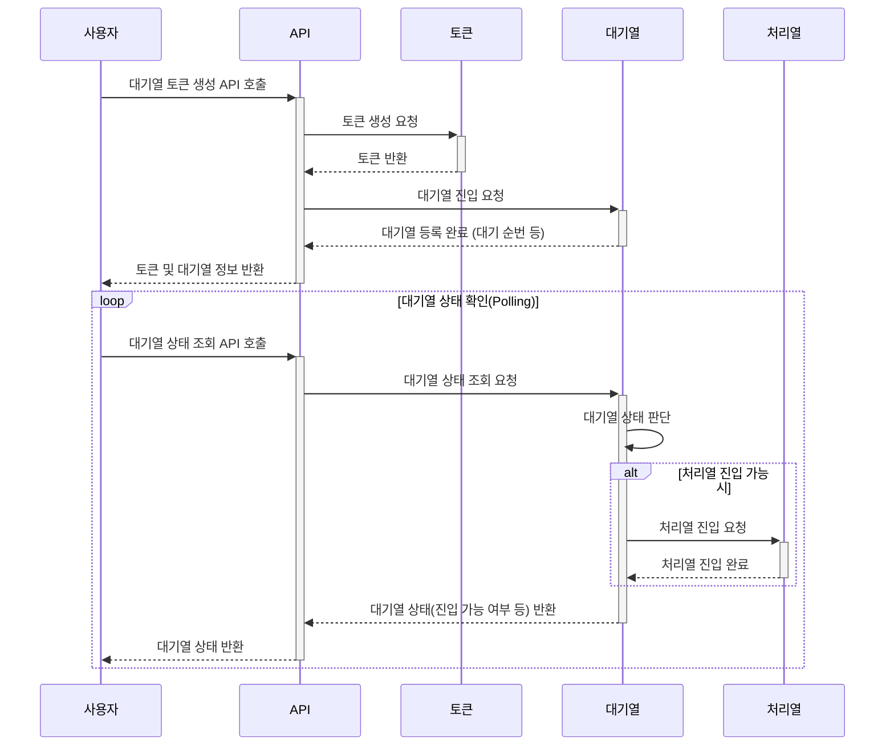
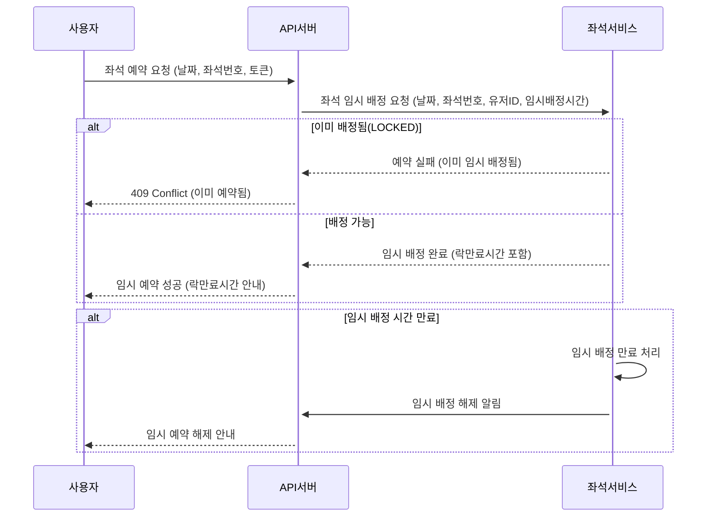
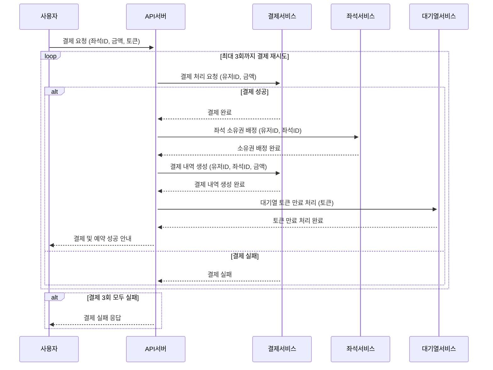

# 시퀀스 다이어그램

## 토큰 발급

```mermaid
sequenceDiagram
participant 사용자
participant API
participant 토큰
participant 대기열
participant 처리열

    사용자->>+API: 대기열 토큰 생성 API 호출
    API->>+토큰: 토큰 생성 요청
    토큰-->>-API: 토큰 반환
    API->>+대기열: 대기열 진입 요청
    대기열-->>-API: 대기열 등록 완료 (대기 순번 등)
    API-->>-사용자: 토큰 및 대기열 정보 반환

    loop 대기열 상태 확인(Polling)
        사용자->>+API: 대기열 상태 조회 API 호출
        API->>+대기열: 대기열 상태 조회 요청
        대기열->>대기열: 대기열 상태 판단
        alt 처리열 진입 가능 시
            대기열->>+처리열: 처리열 진입 요청
            처리열-->>-대기열: 처리열 진입 완료
        end
        대기열-->>-API: 대기열 상태(진입 가능 여부 등) 반환
        API-->>-사용자: 대기열 상태 반환
    end
```

---

## 좌석 예약 

```mermaid
sequenceDiagram
    participant 사용자
    participant API서버
    participant 좌석서비스

    %% 좌석 임시 예약 요청
    사용자->>+API서버: 좌석 예약 요청 (날짜, 좌석번호, 토큰)
    API서버->>+좌석서비스: 좌석 임시 배정 요청 (날짜, 좌석번호, 유저ID, 임시배정시간)
    alt 이미 배정됨(LOCKED)
        좌석서비스-->>API서버: 예약 실패 (이미 임시 배정됨)
        API서버-->>사용자: 409 Conflict (이미 예약됨)
    else 배정 가능
        좌석서비스-->>API서버: 임시 배정 완료 (락만료시간 포함)
        API서버-->>사용자: 임시 예약 성공 (락만료시간 안내)
    end

    %% 임시 배정 만료(결제 없이 시간 초과 시)
    alt 임시 배정 시간 만료
        좌석서비스->>좌석서비스: 임시 배정 만료 처리
        좌석서비스->>API서버: 임시 배정 해제 알림
        API서버-->>사용자: 임시 예약 해제 안내
    end

```
---
## 결제

```mermaid
sequenceDiagram
    participant 사용자
    participant API서버
    participant 결제서비스
    participant 좌석서비스
    participant 대기열서비스

    사용자->>+API서버: 결제 요청 (좌석ID, 금액, 토큰)
    loop 최대 3회까지 결제 재시도
        API서버->>+결제서비스: 결제 처리 요청 (유저ID, 금액)
        alt 결제 성공
            결제서비스-->>API서버: 결제 완료
            API서버->>+좌석서비스: 좌석 소유권 배정 (유저ID, 좌석ID)
            좌석서비스-->>API서버: 소유권 배정 완료
            API서버->>+결제서비스: 결제 내역 생성 (유저ID, 좌석ID, 금액)
            결제서비스-->>API서버: 결제 내역 생성 완료
            API서버->>+대기열서비스: 대기열 토큰 만료 처리 (토큰)
            대기열서비스-->>API서버: 토큰 만료 처리 완료
            API서버-->>사용자: 결제 및 예약 성공 안내
        else 결제 실패
            결제서비스-->>API서버: 결제 실패
        end
    end
    alt 결제 3회 모두 실패
        API서버-->>사용자: 결제 실패 응답
    end
```